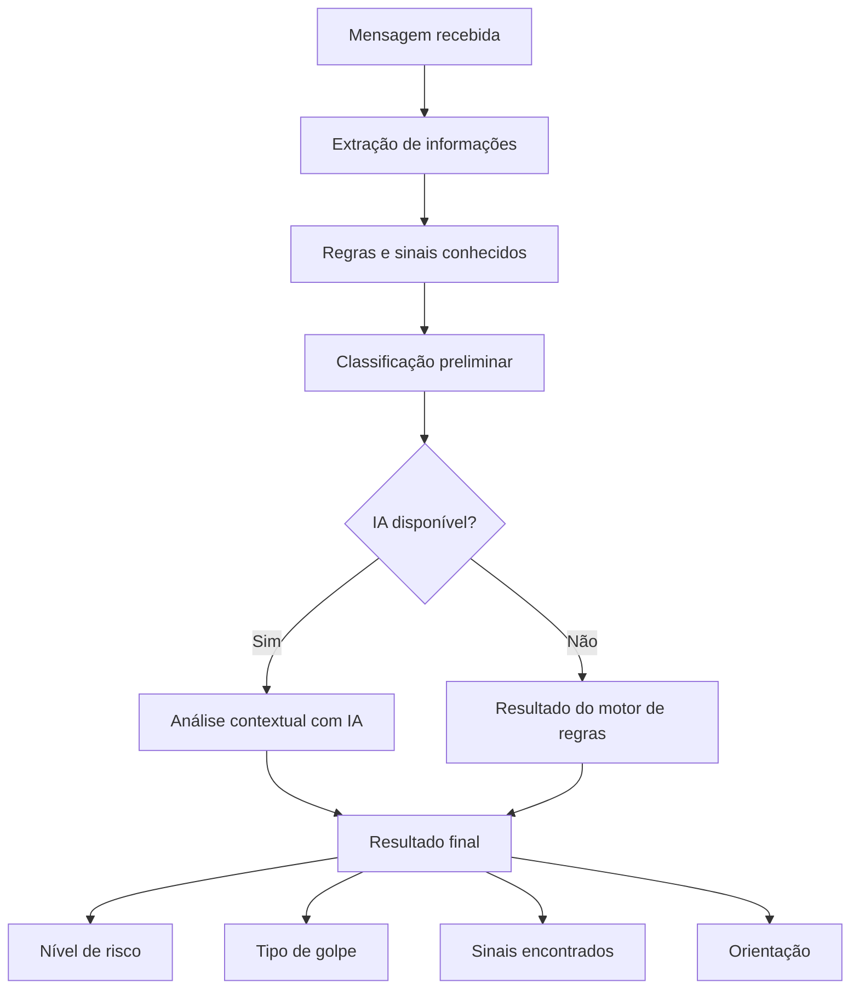

# Pé Atrás

**Verifique antes de confiar.**

O **Pé Atrás** é uma aplicação web educativa criada para ajudar pessoas a identificar sinais de golpes em mensagens recebidas por WhatsApp, SMS, e-mail ou outros canais digitais.

A pessoa cola uma mensagem suspeita e recebe uma análise com **nível de risco, possível tipo de golpe, sinais encontrados e orientações sobre o que fazer**.

O projeto combina verificações determinísticas com análise contextual por inteligência artificial, sem depender exclusivamente de um modelo generativo para tomar a decisão.

**Demo:** [pe-atras.vercel.app](https://pe-atras.vercel.app/)

---

## Sobre o projeto

Golpes digitais frequentemente exploram pressão, urgência e confiança para fazer com que a própria vítima realize uma transferência, clique em um link ou forneça informações sensíveis.

O Pé Atrás foi pensado para atuar justamente nesse momento de dúvida.

Em vez de responder apenas **“é golpe”** ou **“não é golpe”**, a aplicação procura explicar:

* qual é o nível de risco da mensagem;
* qual tipo de fraude pode estar sendo utilizado;
* quais elementos chamaram atenção;
* o que a pessoa pode fazer antes de tomar uma decisão.

O nome resume a proposta do projeto: criar um pequeno momento de reflexão antes de confiar, clicar ou pagar.

---

## Como funciona

A análise acontece no servidor e utiliza diferentes camadas.



### 1. Extração determinística

A aplicação procura elementos objetivos presentes na mensagem, como:

* links;
* chaves Pix;
* valores;
* telefones;
* expressões de urgência;
* pedidos de dinheiro;
* padrões comuns utilizados em golpes.

### 2. Motor de regras

Os elementos encontrados são avaliados por regras com pesos diferentes.

Entre os padrões analisados estão, por exemplo:

* troca repentina de número;
* pedido urgente de Pix;
* links encurtados;
* pedido de senha;
* páginas ou endereços suspeitos;
* imitação de banco ou empresa;
* pressão para tomar uma decisão rapidamente.

Essa camada é determinística e pode ser testada e auditada sem depender de inteligência artificial.

### 3. Análise contextual com IA

Quando configurada, a aplicação utiliza um modelo de linguagem por meio do **OpenRouter**.

A IA recebe a mensagem acompanhada dos sinais encontrados pelo motor de regras e ajuda a interpretar o contexto da abordagem.

A resposta é estruturada contendo:

* risco;
* tipo de golpe;
* explicação;
* sinais identificados;
* orientação.

### 4. Fallback

Se a integração com IA estiver indisponível ou não estiver configurada, o Pé Atrás continua funcionando usando o motor de regras.

A aplicação, portanto, **não depende completamente da IA para produzir um resultado**.

---

## Interface

A interface foi desenvolvida para manter o fluxo simples:

1. colar a mensagem recebida;
2. solicitar a análise;
3. compreender o resultado;
4. identificar os sinais encontrados;
5. receber uma orientação de segurança.

Também existem mensagens de exemplo para testar rapidamente cenários como:

* falso familiar;
* falsa comunicação bancária;
* falsa cobrança relacionada a entrega.

A interface é responsiva e pode ser utilizada tanto em desktop quanto em dispositivos móveis.

---

## Tecnologias

O projeto foi desenvolvido com:

* **Next.js 15**
* **React 19**
* **TypeScript**
* **OpenRouter**
* **Vitest**
* **Vercel**
* CSS próprio para a interface

---

## Arquitetura

A aplicação está organizada aproximadamente da seguinte forma:

```text
app/
├── api/
│   └── analisar/
│       └── route.ts
├── globals.css
├── layout.tsx
└── page.tsx

lib/
├── catalogo.ts
├── classificador.ts
├── extracao.ts
├── ia.ts
├── rate-limit.ts
├── sinais.ts
└── tipos.ts

tests/
evals/
docs/
.github/
```

### Principais responsabilidades

`lib/extracao.ts`
Extrai informações objetivas da mensagem.

`lib/sinais.ts`
Aplica regras e identifica padrões suspeitos.

`lib/classificador.ts`
Realiza a classificação baseada nas regras.

`lib/ia.ts`
Executa a análise contextual utilizando o OpenRouter.

`lib/rate-limit.ts`
Limita a quantidade de requisições por IP.

`app/api/analisar/route.ts`
Coordena o fluxo de análise no servidor.

---

## Testes automatizados

O projeto possui testes automatizados para partes importantes do motor de análise.

Atualmente são **11 testes**, distribuídos entre:

* classificação;
* extração;
* rate limiting.

Para executar:

```bash
npm test
```

Resultado validado:

```text
Test Files  3 passed
Tests      11 passed
```

---

## Avaliação do motor de regras

Além dos testes unitários, o projeto possui um conjunto separado de mensagens rotuladas para avaliar o comportamento do classificador determinístico.

Para executar:

```bash
npm run evals
```

Na avaliação atual:

| Métrica               | Resultado |
| --------------------- | --------: |
| Casos avaliados       |        24 |
| Acurácia              |     83,3% |
| Precisão              |     90,0% |
| Recall                |     75,0% |
| Verdadeiros positivos |         9 |
| Verdadeiros negativos |        11 |
| Falsos positivos      |         1 |
| Falsos negativos      |         3 |

### Matriz de confusão

```text
Golpes detectados corretamente:  9
Mensagens legítimas corretas:    11
Falsos positivos:                 1
Falsos negativos:                 3
```

Esses números representam **somente o motor de regras**, sem a camada de inteligência artificial.

Os casos mais difíceis são justamente mensagens sutis, nas quais não existem palavras-chave ou elementos suspeitos óbvios. A análise contextual por IA foi adicionada como uma segunda camada para ajudar nesse tipo de cenário.

A existência dos evals também permite identificar onde o motor determinístico ainda pode ser melhorado.

---

## Build de produção

O projeto também foi validado com o build de produção do Next.js:

```bash
npm run build
```

Com:

* compilação concluída;
* validação de TypeScript concluída;
* geração das páginas concluída;
* rota da API funcionando como conteúdo dinâmico.

---

## Executando localmente

### Pré-requisitos

* Node.js 18.18 ou superior
* npm

Clone o repositório:

```bash
git clone https://github.com/gabrielle-git/pe-atras.git
cd pe-atras
```

Instale as dependências:

```bash
npm install
```

Crie o arquivo de variáveis de ambiente:

```bash
cp .env.local.example .env.local
```

No Windows, também é possível simplesmente criar manualmente um arquivo chamado:

```text
.env.local
```

Depois execute:

```bash
npm run dev
```

A aplicação ficará disponível em:

```text
http://localhost:3000
```

---

## Variáveis de ambiente

A integração com IA utiliza variáveis de ambiente para impedir que credenciais sejam expostas no navegador.

```env
OPENROUTER_API_KEY=
OPENROUTER_MODEL=
RATE_LIMIT_MAX=
RATE_LIMIT_WINDOW_MS=
```

### `OPENROUTER_API_KEY`

Chave utilizada para acessar o OpenRouter.

### `OPENROUTER_MODEL`

Permite configurar o modelo utilizado na análise.

### `RATE_LIMIT_MAX`

Quantidade máxima de análises permitidas por IP dentro da janela configurada.

### `RATE_LIMIT_WINDOW_MS`

Duração da janela do rate limiting em milissegundos.

A chave da IA é utilizada apenas no servidor e não é enviada ao navegador.

---

## Privacidade

Mensagens suspeitas podem conter informações pessoais. Por isso, o projeto foi desenvolvido considerando alguns cuidados:

* a chave da IA permanece no servidor;
* a interface orienta a não inserir senhas ou dados bancários completos;
* existe documentação específica sobre privacidade e LGPD;
* a aplicação não apresenta o resultado como uma garantia absoluta de segurança.

Mais detalhes estão disponíveis em:

```text
docs/privacidade-lgpd.md
```

---

## Limitações

O Pé Atrás é uma ferramenta educativa e experimental.

Ele **não substitui uma análise especializada** e não pode garantir que uma mensagem seja segura.

Algumas limitações importantes:

* golpes novos podem não estar presentes no catálogo de regras;
* mensagens muito sutis podem não gerar sinais determinísticos suficientes;
* modelos de IA também podem interpretar mensagens incorretamente;
* uma mensagem aparentemente legítima ainda pode fazer parte de uma fraude mais ampla;
* o contexto disponível é limitado ao conteúdo informado pelo usuário.

Por isso:

> **“Sem sinais de golpe” não significa “seguro”.**

Na dúvida, a recomendação é confirmar a informação por outro canal antes de pagar, clicar ou fornecer dados.

---

## Segurança da abordagem

Uma decisão importante do projeto foi **não enviar diretamente toda a responsabilidade de classificação para a IA**.

Antes da análise contextual, a aplicação realiza verificações determinísticas.

Essa abordagem permite:

* reduzir dependência do modelo;
* manter parte da decisão auditável;
* executar testes automatizados;
* medir o desempenho do classificador;
* manter um fallback quando a IA estiver indisponível;
* fornecer contexto estruturado ao modelo.

---

## Scripts

```bash
npm run dev
```

Executa o ambiente de desenvolvimento.

```bash
npm run build
```

Gera o build de produção.

```bash
npm start
```

Executa o build produzido.

```bash
npm test
```

Executa os testes automatizados.

```bash
npm run evals
```

Executa a avaliação do motor de regras.

---

## Deploy

A aplicação está publicada na Vercel:

**[pe-atras.vercel.app](https://pe-atras.vercel.app/)**

O deploy de produção utiliza as variáveis de ambiente configuradas diretamente na plataforma.

---

## Documentação

O repositório também possui documentação complementar:

```text
docs/arquitetura.md
docs/avaliacao.md
docs/privacidade-lgpd.md
docs/adr/
```

Os ADRs registram decisões técnicas adotadas durante o desenvolvimento.

---

## Possíveis evoluções

Algumas evoluções futuras do projeto incluem:

* ampliar a base de mensagens utilizadas nos evals;
* melhorar o recall do motor determinístico;
* adicionar novas categorias de golpes;
* avaliar separadamente o desempenho da camada com IA;
* testar diferentes modelos de linguagem;
* aprimorar regras a partir dos falsos negativos identificados;
* incluir novas formas de entrada além de texto.

---

## Aviso

O Pé Atrás fornece **orientação educativa**.

O resultado da análise não representa garantia de autenticidade ou segurança.

Antes de realizar pagamentos, clicar em links ou compartilhar informações sensíveis, confirme a solicitação utilizando canais oficiais.

---

## Projeto acadêmico

O Pé Atrás foi desenvolvido como projeto acadêmico com foco na aplicação prática de:

* desenvolvimento web;
* inteligência artificial;
* classificação baseada em regras;
* testes automatizados;
* avaliação de desempenho;
* segurança e privacidade em aplicações digitais.
